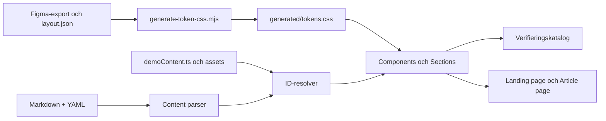

# Jägersro webb

Det här repositoryt innehåller den första tekniska grunden för Jägersros nya webb: ett React-baserat designsystem, en verifieringskatalog och CMS-förberedda exempel på en landningssida och en artikelsida.

Projektet är ännu inte den färdiga produktionswebben. Katalogen används för att utveckla och kvalitetssäkra foundations, komponenter och redaktionella sektioner innan de kopplas till ett riktigt CMS.

## Kom igång

### Förutsättningar

- Node.js `^20.19.0` eller `>=22.12.0`
- npm

### Installation och lokal utveckling

```bash
npm ci
npm run dev
```

Vite visar därefter den lokala adressen, normalt [http://localhost:5173](http://localhost:5173).

### Viktiga kommandon

| Kommando | Användning |
|---|---|
| `npm run dev` | Genererar tokens och startar utvecklingsservern. |
| `npm run tokens:generate` | Skapar `src/generated/tokens.css` från tokenkällorna. |
| `npm run build` | Genererar tokens, typkontrollerar och bygger en produktionsversion. |
| `npm run preview` | Förhandsvisar den senast byggda versionen lokalt. |

`npm run build` är projektets nuvarande kvalitetsgrind och ska passera före en pull request.

## Så är systemet uppbyggt

Designsystemet är organiserat i tre nivåer. Gränserna är avsiktliga: de gör koden lättare att förstå och gör det möjligt att byta från lokalt demoinnehåll till ett CMS utan att bygga om presentationen.

### Foundations

Foundations är de gemensamma visuella besluten:

- färg och Light/Dark-teman,
- typografi med Geist och Geist Mono,
- responsivt 8-/12-kolumnsgrid,
- spacing och sektionspadding,
- radier och fokusmarkeringar,
- Phosphor Icons,
- rörelseprinciper med GSAP där samordnad animation behövs.

Råa Figma-tokens ligger i `design-tokens/figma-export.json`. Den kuraterade griddefinitionen ligger i `design-tokens/layout.json`. Scriptet `scripts/generate-token-css.mjs` omvandlar dessa till CSS-variabler och typografiklasser i den genererade filen `src/generated/tokens.css`.

Redigera aldrig den genererade CSS-filen manuellt. Ändra källan eller generatorn och kör sedan tokenkommandot.

### Components

Components är små, återanvändbara UI-byggstenar i `src/components/`, exempelvis:

- `Button` och `IconButton`,
- `Select`, `TextField` och `TextArea`,
- `Typography`, `Image` och `Breadcrumb`,
- `SiteNavbar` och `SiteFooter`.

En komponent äger struktur, tillstånd och tillgängligt beteende. Presentationen ligger i namngivna CSS-klasser i `src/styles.css`. Komponenter ska inte känna till en viss sida eller ett CMS-svar.

### Sections

Sections, även kallade patterns i koden, är större redaktionella block i `src/patterns/`, exempelvis:

- Hero och Feature Sections,
- bildsektion, bildgalleri och bildkarusell,
- senaste artiklar,
- projektets tidslinje.

En section äger sin fullbredds-surface och placerar innehållet på den gemensamma `.page-grid`. Varianter uttrycks med ett litet, ändligt prop-kontrakt i stället för separata nästan likadana komponenter.

Alla innehållssektioner kan styra övre och nedre padding separat med `large`, `medium` eller `small`. `large` är det responsiva standardmåttet, `medium` är hälften och `small` är noll.

## Sambandet mellan filerna



| Sökväg | Ansvar |
|---|---|
| `src/components/` | Generella UI-komponenter. |
| `src/patterns/` | CMS-förberedda redaktionella sektioner. |
| `src/catalog/` | Testsidor för foundations, components, sections och färdiga exempel. |
| `src/content/` | Serialiserbara Markdown-fixtures, parsers och delat demoinnehåll. |
| `src/pages/` | Sidmallar som komponerar återanvändbara delar. |
| `src/assets/` | Lokala bilder och godkända grafiska tillgångar för demon. |
| `src/tokens.ts` | Läser tokens för katalogens visuella presentationer och typer. |
| `src/layout.ts` | Typsatt åtkomst till gridens breakpoints. |
| `src/styles.css` | Handskrivna komponent- och layoutklasser. |
| `src/generated/` | Genererad CSS; versionshanteras inte. |
| `design-tokens/` | Källor för visuella tokens och grid. |
| `scripts/` | Små byggscript, i dag främst token-generering. |

## CMS-förberedelsen

Landningssidan i `src/content/landing-page.md` fungerar som ett enkelt lokalt headless CMS. Varje H2-rubrik följs av ett YAML-block som beskriver en section, dess tema, bakgrund, spacing, variant och innehåll. Ordningen i Markdown-filen är ordningen på sidan.

Flödet är:

1. `landingPageContent.ts` läser och typbestämmer YAML-posterna.
2. `LandingPageCatalog.tsx` mappar varje `type` till rätt section-komponent.
3. Bild-, artikel-, galleri- och tidslinje-ID:n löses mot `demoContent.ts`.
4. Komponenten får ett litet serialiserbart prop-kontrakt och renderar samma UI oavsett innehållskälla.

Artikelsidan följer samma princip genom `article-page.md`, `articlePageContent.ts` och `ArticlePage.tsx`.

När ett riktigt CMS införs ska främst Markdown-läsaren och ID-resolvern ersättas. Sections ska fortsatt få samma domänanpassade props. Skicka inte CMS-leverantörens råa svar, React-element eller CSS-positioner genom innehållskontraktet.

## Katalogen

Vänstermenyn delar upp verifieringen i:

- **Foundations:** Typography, Colors, Grid & Spacing och Icons.
- **Components:** knappar, formulärfält, breadcrumb, image och andra byggstenar.
- **Sections:** de större CMS-förberedda sidblocken.
- **Examples:** sammansatta sidor byggda enbart av publika komponent- och section-API:er.

Grid-overlayn kan aktiveras för att kontrollera kolumnlinjer. Katalogens globala Light/Dark-toggle används för isolerade tester; Landing page och Article page äger egna lokala teman och ska inte påverkas av den togglen.

Katalogen ska alltid motsvara den aktuella implementationen. När tokens, foundations, komponenter, varianter, states, responsivt beteende, sektioner eller exempel ändras ska motsvarande katalogvy uppdateras i samma ändring. Föråldrade specimens och avslutade migrationslägen ska tas bort, inte ligga kvar som historisk dokumentation.

## Vanliga arbetsflöden

### Lägg till eller ändra en foundation

1. Uppdatera rätt tokenkälla eller ett uttryckligt designbeslut i `DESIGN.md`.
2. Anpassa token-generatorn vid behov.
3. Kör `npm run tokens:generate`.
4. Visa och verifiera resultatet under Foundations i katalogen.

### Lägg till en komponent

1. Skapa komponenten i `src/components/` med ett litet, återanvändbart API.
2. Lägg presentationen som läsbara klasser i `src/styles.css`.
3. Lägg till en katalogvy under Components med relevanta states och varianter.
4. Verifiera tangentbord, fokus, Light/Dark och responsivitet.

### Lägg till en section

1. Definiera ett serialiserbart innehållskontrakt i `src/patterns/`.
2. Bygg sektionen av befintliga components och `.page-grid`.
3. Lägg till en katalogvy under Sections.
4. Utöka `LandingPageSection` och dess renderer om modulen ska kunna användas från Markdown.
5. Lägg in demoinnehåll med stabila ID:n, inte layoutvärden.

### Ändra landningssidans innehåll

Ändra i första hand `src/content/landing-page.md`. Använd en befintlig section-typ och referera delade poster med deras ID. Ändra React-kod endast när innehållskontraktet eller en faktisk komponentförmåga behöver utvecklas.

## Styrande dokument

| Dokument | Läs när du behöver förstå |
|---|---|
| `productHome.md` | Produktvision, målgrupper, innehållsprinciper och prioriteringar. |
| `DESIGN.md` | Visuell identitet, tokens, grid, komponentregler, bildspråk och rörelse. |
| `DEVELOPMENT.md` | Kodprinciper, arbetsmetod, verifiering och förändringsdisciplin. |
| `AGENTS.md` | Lokala instruktioner för AI-verktyg och skrivskyddat referensmaterial. |

Vid konflikt gäller produktbeslut i `productHome.md`, designbeslut i `DESIGN.md` och genomföranderegler i `DEVELOPMENT.md` inom respektive område.

## Git och GitHub

Repositoryt är förberett för GitHub genom att beroenden, builds, genererade tokens, temporära renderingar, operativsystemsfiler och lokala miljöfiler ignoreras.

Följande ska normalt versionshanteras:

- källkod under `src/`, förutom `src/generated/`,
- `design-tokens/`, `scripts/` och konfigurationsfiler,
- `package.json` och `package-lock.json`,
- README och styrande Markdown-dokument.

Projektet har ännu ingen vald licens. Lägg inte till en open source-licens utan ett uttryckligt beslut från projektägaren.

## Nuvarande avgränsningar

- Ingen produktionskoppling till CMS finns ännu.
- Ingen routing, backend, formulärendpoint, analys eller produktionsdriftsättning är konfigurerad.
- Katalogen och demoinnehållet är utvecklingsverktyg, inte slutlig informationsarkitektur eller redaktionellt material.
- Automatiserade tester och linting är ännu inte införda; typkontroll och produktionsbygge är nuvarande miniminivå.
